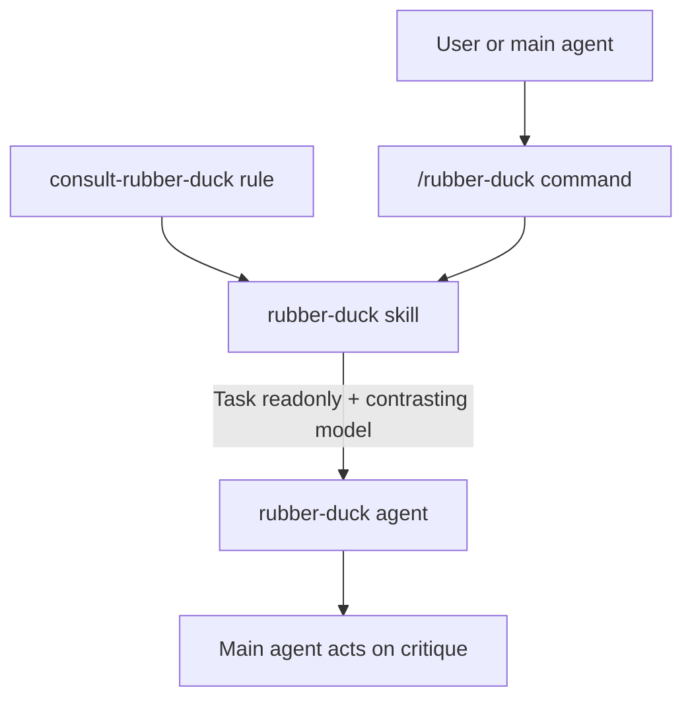

# Rubber Duck plugin

Constructive second-opinion critic for Cursor agents — inspired by [GitHub Copilot’s rubber duck agent](https://docs.github.com/en/copilot/concepts/agents/copilot-cli/rubber-duck). Reviews plans, code, and tests on a **contrasting model family**, returns Blocking / Non-blocking / Suggestions, and never edits files.

## Installation

```bash
/add-plugin cursor-rubber-duck
```

## Architecture



## When it consults

With the plugin installed, the always-on rule asks the main agent to consult the duck at high-leverage moments:

- After planning a non-trivial change, before implementing
- Mid-implementation on complex work
- After writing tests
- After repeated failures or unexpected results

Trivial edits are skipped. You can always force a critique with `/rubber-duck` or natural language ("Rubber duck your plan").

## Components

| Component | Name | Role |
|:----------|:-----|:-----|
| Skill | `rubber-duck` | Package context, pick contrasting model, spawn critic, act on feedback |
| Agent | `rubber-duck` | Read-only constructive critic |
| Rule | `consult-rubber-duck` | When to seek a second opinion |
| Command | `/rubber-duck` | Manual critique with optional focus question |

## Typical usage

**Manual:**

```text
/rubber-duck What edge cases are missing?
```

**Automatic:** after a non-trivial plan, the main agent should spawn `rubber-duck` with `readonly: true` and a model from a different family, then summarize the critique and address Blocking findings before implementing.

## Severity buckets

- **Blocking** — must fix for the work to succeed
- **Non-blocking** — should fix to improve quality / reduce risk
- **Suggestions** — lower priority, still material

Style, formatting, naming, and nit best-practices are out of scope.

## License

MIT
