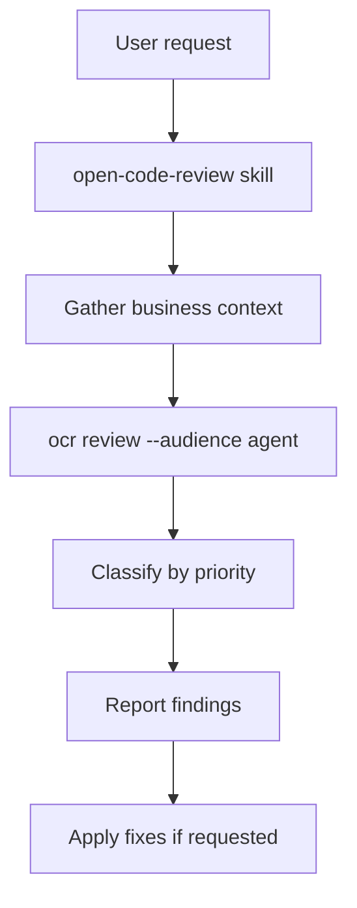

# Open Code Review plugin

AI-powered code review on Git diffs — supports workspace changes, branch ranges, and single commits with concurrent per-file analysis, codebase search, and deep context-aware review.

## Installation

```bash
/add-plugin open-code-review
```

### Prerequisites

The plugin requires the `ocr` CLI:

```bash
npm install -g @alibaba-group/open-code-review
```

Configure an LLM backend before first use:

```bash
ocr config set llm.url https://api.anthropic.com/v1/messages
ocr config set llm.auth_token <your-api-key>
ocr config set llm.model claude-opus-4-6
ocr config set llm.use_anthropic true
```

Verify connectivity:

```bash
ocr llm test
```

## Architecture



## Skills

| Skill | Description |
|:------|:------------|
| `open-code-review` | Run `ocr` CLI to review Git diffs — workspace changes, branch ranges, or single commits. Classifies findings by priority and optionally applies fixes. |

## Typical usage

**Review workspace changes:**

```
@open-code-review review my current changes
```

**Review a branch against main:**

```
@open-code-review review this branch against main
```

**Review a specific commit:**

```
@open-code-review review commit abc1234
```

**Review and auto-fix high-confidence issues:**

```
@open-code-review review and fix high-confidence issues
```

## Custom review rules

Create `.opencodereview/rule.json` in your repo root:

```json
{
  "rules": [
    {
      "path": "**/*.ts",
      "rule": "All exported functions must have JSDoc comments"
    }
  ]
}
```

See [rule documentation](https://github.com/alibaba/open-code-review#custom-review-rules) for details.

## License

Apache-2.0
