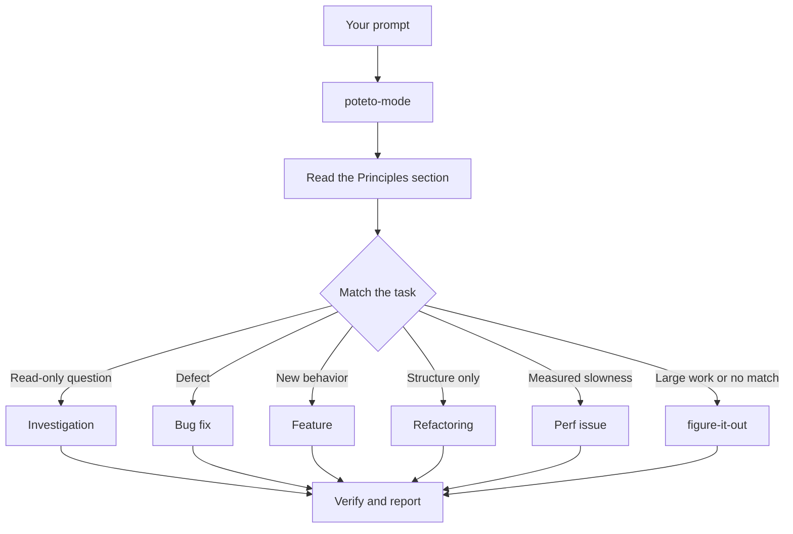

# Route work through `/poteto-mode`

`/poteto-mode` is the front door. You give it a goal, it matches one of sixteen playbooks, copies that playbook's steps into the todo list, and calls the other skills as the steps need them. In this page you learn what a good prompt looks like, and how little of one you actually need.


## What happens to your prompt



The diagram shows the common routes. There are also playbooks for hillclimbing a metric, diagnosing runtime symptoms and captured traces, prototypes, visual parity, authoring and evaluating skills, autonomous runs, session pickup, pausing safely, and multi-phase plans. The [playbook directory](../../skills/poteto-mode/playbooks/) has the full set.

## Say the goal, not the ceremony

You don't write a spec. You say what's wrong or what you want, plus anything you already know that saves the agent time:

```text
/poteto-mode users get two notifications after a retry. repro first, then fix and verify.
```

That's a Bug fix prompt. "repro first" is a real constraint, not politeness, and the playbook honors it. Watch the todo list fill with the Bug fix steps. A skipped step stays visible with `skip: <reason>`.

When the conversation already carries the context, the prompt shrinks to almost nothing. All of these are enough:

```text
/poteto-mode do it
```

```text
continue
```

```text
keep going until done
```

Short works because the mode is sticky and the playbook holds the structure. Your words carry the intent, and the skill carries the rigor.

## Switch tasks with "new task"

A long chat accumulates context from the last task. When you change subjects, say so:

```text
/poteto-mode new task. figure out why the cache entry survives logout. don't change any code yet.
```

"new task" tells `/poteto-mode` to re-match rather than continue the prior playbook. "don't change any code yet" pins this one to Investigation. Without those two phrases, a mode mid-Feature tends to treat your question as the next feature step.

## Give parallel work its own worktree

If you run several agents against one repository, they will fight over the working tree. Ask for isolation up front:

```text
/poteto-mode new task. branch off <base> in a fresh worktree, then port the parser change there.
```

Each task in its own branch and worktree means no agent stomps another's files. The [Opening a PR playbook](../../skills/poteto-mode/playbooks/opening-a-pr.md) already works from a worktree for code changes, so mostly you only say this when a specific base or location matters.

## Leave it running

When you step away, say what done means and go:

```text
/poteto-mode im stepping away. keep going until the migration check reports zero old callers. log your decisions.
```

Work you'll review later routes through [`/figure-it-out`](../../skills/figure-it-out/SKILL.md), which designs the run's phases and keeps a [`/show-me-your-work`](../../skills/show-me-your-work/SKILL.md) decision log. [Run work while you sleep](./07-overnight.md) covers the full overnight contract.

**Pitfall:** don't enumerate skills in your prompt ("use /how, then /architect, then /arena..."). The playbook already sequences them, and a hand-written sequence usually reorders or drops steps the playbook would have kept. Name a skill only when you want to override a specific choice.

Read [`poteto-mode`](../../skills/poteto-mode/SKILL.md) itself for the full routing rules.

Next: [Understand the code](./03-understand.md).
