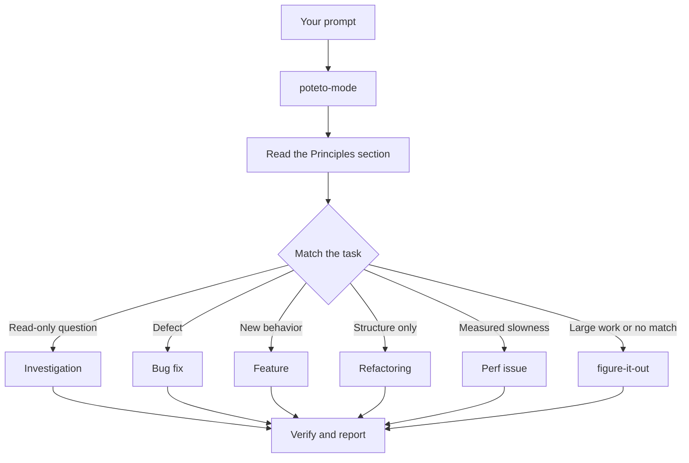

# Route work through `/poteto-mode`

Use `/poteto-mode` for a task with several steps or a result you must verify. Give `/poteto-mode` the task. Give `/poteto-mode` the finish condition. `/poteto-mode` matches a playbook. It copies the playbook steps into the todo list. When a step requires another skill, `/poteto-mode` calls that skill.

## Follow the routing rules



The diagram shows the common routes. Use the other bundled playbooks for these tasks:

- Improve one metric through repeated attempts.
- Diagnose a live runtime symptom.
- Diagnose a saved trace.
- Build a prototype.
- Match a visual reference.
- Write or edit a skill.
- Test a skill change.
- Continue an unattended run.
- Continue a prior session.
- Pause work.
- Write a multi-phase plan.

Read the [playbook directory](../../skills/poteto-mode/playbooks/) for the full list.

## Describe the result

State the result instead of listing skills:

```text
/poteto-mode fix the duplicate notification.
Reproduce it first.
The finish condition is one notification after three retries.
```

The todo list should contain the Bug fix steps. `/poteto-mode` keeps each skipped step and adds `skip: <reason>`.

If the task is already clear from the conversation, short prompts work:

```text
/poteto-mode do it
```

If the prior messages state the task and finish condition, send this plain follow-up:

```text
continue
```

## Match a new playbook when the task changes

If you switch tasks in the same chat, say:

```text
/poteto-mode new task.
Investigate why the cache entry survives logout.
Do not change code.
```

`new task` is a plain prompt phrase. It tells `/poteto-mode` to match the new request to a playbook. The read-only request should select Investigation instead of continuing the prior build playbook.

## Use a separate worktree

If another agent uses the repository, ask for an isolated worktree:

```text
/poteto-mode new task.
Create a branch from <base>.
Create a separate worktree for that branch.
Implement the parser change in that worktree.
```

A separate branch and worktree keep this task's files and commits apart from other work. The [Opening a PR playbook](../../skills/poteto-mode/playbooks/opening-a-pr.md) defines the branch, commit, and PR flow for code changes.

## Set a finish condition before you leave

State a checkable finish condition before you leave:

```text
/poteto-mode I am stepping away.
Keep working until the migration check reports zero old callers.
Log each decision for review.
```

When you leave work for later review, `/poteto-mode` uses `/figure-it-out`. `/figure-it-out` invokes `/show-me-your-work` to record decisions. If no bundled playbook fits, `/poteto-mode` also uses `/figure-it-out`.

Read [`poteto-mode`](../../skills/poteto-mode/SKILL.md) for the routing rules. If you want the full unattended workflow, read [Run work while you are away](./07-overnight.md).

Next: [Understand the code](./03-understand.md).
