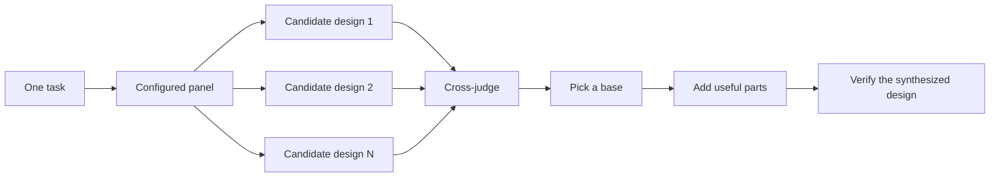

# Design before you write code

When a design would be costly to reverse, start with `/architect`. `/architect` already runs `/arena`. If you want several attempts at another artifact, run `/arena` directly. Before you ship a contested design, run `/interrogate`.

## Sketch the contract with `/architect`

Run:

```text
/architect design the import pipeline.
Do not write code yet.
Show the caller usage, types, function signatures, and module ownership.
```

When code already exists, [`/architect`](../../skills/architect/SKILL.md) runs `/how` first. If the design changes ownership or layers, `/architect` also runs `/why`. `/architect` then runs `/arena` to compare complete candidate designs.

The synthesized design starts with caller usage. It includes types, signatures, a module map, and a synthesis decision.

If you want to review the synthesized design before implementation, ask for a checkpoint:

```text
/architect with checkpoint.
Stop after the synthesized design.
Wait for my review.
```

Without that request, `/architect` proceeds from the synthesized design into implementation.

## Compare alternatives with `/arena`

Use `/arena` directly when you want several attempts at the same artifact:

```text
/arena compare candidate designs for the cache key format.
Keep each candidate output separate.
Judge each design on migration safety, lookup cost, and reader load.
```



[`/arena`](../../skills/arena/SKILL.md) writes each candidate design to a separate path. A read-only judge scores every candidate design. The coordinating agent reads each design and chooses a base. It adds selected parts from other designs. It records each rejection. It then verifies the synthesized design.

Your [`setup-pstack` configuration](../../skills/setup-pstack/SKILL.md) controls the panel. The guide does not assume a specific model.

## Challenge the result with `/interrogate`

Run:

```text
/interrogate review this branch against the stated intent.
Do not change files.
If a style comment does not expose a maintenance risk, ignore it.
```

[`/interrogate`](../../skills/interrogate/SKILL.md) sends the same intent, diff, and rubric to the configured review panel. It returns one verdict with `Act on`, `Consider`, `Noted`, and `Dismissed` findings. It does not apply fixes.

Review the `Act on` findings. Check the dismissed findings too. The lead explains each dismissal. You can override a dismissal.

## Choose the amount of design work

For a small finished change, use `/interrogate` alone. When function boundaries or module ownership change, use `/architect`. If several independent answers would improve a separate decision, run `/arena` directly. Before you ship a contested design that would be costly to reverse, run `/interrogate`.

Most changes do not need the full sequence.

Next: [Build and clean the change](./05-build-and-clean.md).
