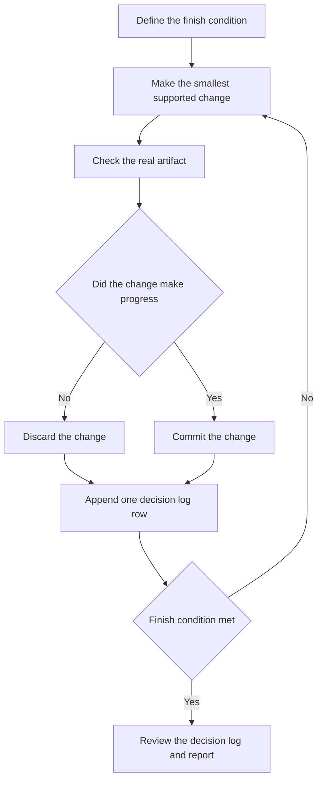

# Run work while you are away

Turn a long task into an unattended run with a checkable finish condition. Keep the work isolated. Record each decision. When you step away, use `/figure-it-out` even if the task follows a known playbook. Use the Autonomous run playbook to repeat each check.

## Define the unattended run

Before you leave, give `/poteto-mode` six inputs:

1. State the exact finish condition.
2. Request an isolated worktree from the named base branch.
3. State which writes the agent may make.
4. Name the verification command or artifact.
5. Request a `/show-me-your-work` decision log.
6. Give a stop condition for a genuine dead end.

Use a prompt like this:

```text
/poteto-mode I am stepping away.
Use <base> as the base branch.
Create an isolated worktree.
Migrate every caller to the new parser in that worktree.
Use this finish condition:
- No caller uses the old API.
- All parser fixtures pass.
- The old API no longer exists.
Before editing, use /figure-it-out to design the phases.
Keep a /show-me-your-work decision log.
Add evidence for each decision or checkpoint.
Until the finish condition passes, keep the run active with Cursor's /loop.
If no viable approach remains, stop.
Record the evidence.
```

Before writing code, `/figure-it-out` writes the workflow. The workflow expresses the finish condition as a check that every iteration can run.

## Follow the unattended loop



The [Autonomous run playbook](../../skills/poteto-mode/playbooks/autonomous-run.md) uses Cursor's `/loop` command to wake the run for a later check. `/loop` is a Cursor command, not a pstack skill.

Each iteration follows this sequence:

1. Make one evidence-backed change.
2. Check the finish condition.
3. If the change made progress, commit it.
4. If the change did not help, discard it.
5. Append one row to the decision log.

## Use `/figure-it-out` before unattended work

When you will review work after stepping away, use [`/figure-it-out`](../../skills/figure-it-out/SKILL.md). Use it also for large migrations, cross-cutting work, or tasks with no matched playbook. It writes a phased workflow with a baseline, isolated work, explicit verdicts, and final verification.

Run `/figure-it-out` once for the unattended run. After the workflow settles the main design, do not run another design comparison. If new evidence invalidates the design, compare the designs again.

## Keep a reviewable decision log

[`/show-me-your-work`](../../skills/show-me-your-work/SKILL.md) writes one append-only TSV row for each decision or checkpoint. Each row records the time, phase, decision, reason, evidence pointer, and result. The default path is `decisions.tsv` or `.audit/<task-slug>.tsv`.

For routine work, keep the decision log local. When a reviewer needs the decision log for a large change, commit it.

When you return, run:

```text
/show-me-your-work summarize the unattended run.
Compare the decision log with the transcript.
Flag weak evidence.
```

Before `/show-me-your-work` reports the run, it asks a different model family to review the decision log. The final report states the finish condition, iteration count, and final result. It lists accepted changes, discarded changes, open work, and review flags.

Next: [Understand the principles](./08-principles.md).
