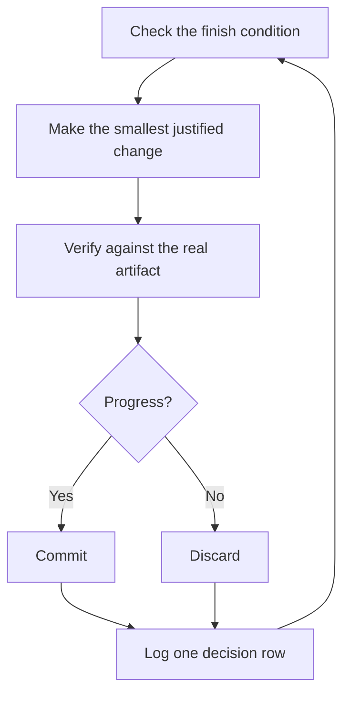

# Run work while you sleep

This is the payoff for everything before it. An agent you can trust to verify its own work is an agent you can leave alone with a hard task. What makes that safe isn't hope. It's a checkable finish condition, an isolated worktree, and a decision log you audit in the morning.

## The overnight contract

A good handoff has the goal, the finish condition, permissions, and an escape hatch. It doesn't need to be long:

```text
/poteto-mode im going to bed. migrate every caller to the new parser in a fresh worktree off <base>.
done means zero old callers, all parser fixtures pass, old api deleted.
keep a decision log. don't ask me before committing.
/loop until done. if you're truly stuck after a few hours, stop and write up why.
```

Walk through what each line buys you:

- "im going to bed" is a session override. The agent stops asking and keeps going.
- "done means..." turns the goal into checks every iteration can run.
- "fresh worktree off `<base>`" keeps the run from colliding with anything else you have open.
- "don't ask me before committing" pre-answers the permission the agent would otherwise block on.
- `/loop` is Cursor's built-in wake mechanism, not a pstack skill. The [Autonomous run playbook](../../skills/poteto-mode/playbooks/autonomous-run.md) uses it to re-check the finish condition on events or a heartbeat.
- The escape hatch lets it stop at a genuine dead end and write up why, which beats eight hours of creative goal reinterpretation.

Because you'll review this work after stepping away, `/poteto-mode` routes it through [`/figure-it-out`](../../skills/figure-it-out/SKILL.md), which designs the run's phases before any code and wires in the decision log.

## What the loop does all night



One change, one check, one log row, every iteration. Changes that didn't help get discarded, not left to ride. A plateau means pivot, not stop, and the finish condition never quietly relaxes to declare victory.

## The morning audit

[`/show-me-your-work`](../../skills/show-me-your-work/SKILL.md) is what makes the run reviewable. Each row records the time, phase, decision, reason, an evidence pointer, and the result, in a TSV at `decisions.tsv` (or `.audit/<task-slug>.tsv` when several runs share a directory). It stays local by default. Commit it when the work is ambitious enough that a reviewer needs the trail to trust the result.

When you're back, ask for the run in review form:

```text
/show-me-your-work catch me up on what you did last night
```

Before the skill hands back its summary, it spawns a reviewer on a different model family to read the trail and the transcript, and the reply ends with an Attention section listing what deserves your scrutiny. Read that section first, then the log rows it points at. You're auditing decisions, not re-reading the whole night.

**Pitfall:** a duration is not a finish condition. "work on this for 4 hours" gives the agent nothing to check, and you'll wake up to four hours of motion instead of a result. Give `/loop` a predicate that can pass or fail.

Next: [Steer with principle names](./08-principles.md).
